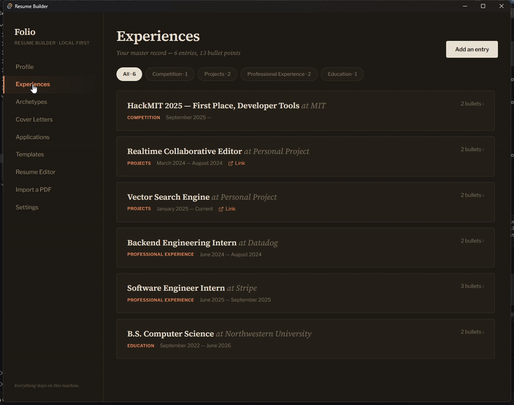

# Resume Builder

A local-first desktop app for tailored resumes and cover letters. Maintain one
master pool of experiences, bullet points, and skills, tag them into role-specific
**archetypes**, and generate a polished LaTeX resume PDF plus an AI cover letter
for each — entirely on your own machine.

**Tauri 2** (Rust backend) · **React 19 / TypeScript / Vite / Tailwind** ·
on-device embeddings + RAG · a cover-letter model fine-tuned *and evaluated* in
this repo.

[**Download an installer**](https://github.com/sinj3d/resume-builder/releases) ·
[Fine-tuning pipeline & full eval](training/README.md)



<sub>Master record → archetype → paste a real posting → retrieval keeps what answers it and fits the page → restyle. Switching one entry off frees space and the entry that didn't fit comes back. Demo profile is fictional.</sub>

## A fine-tuned model, measured

The cover-letter model isn't a wrapped API call — it's trained in
[`training/`](training/README.md) and benchmarked against the stock base on
**120 held-out letters** (20 real scraped job descriptions × 3 templates × 2
models, byte-identical prompts, `--temp 0`, each scored 1–5 by a judge model):

| Criterion | Base | Tuned | Δ |
| --- | --- | --- | --- |
| template_adherence | 1.85 | **3.28** | +1.43 |
| grounding (no fabrication) | 3.05 | **4.12** | +1.07 |
| writing_quality | 3.03 | **3.73** | +0.70 |

Fabricated claims across the run: **98 → 46**. Letters with zero fabrication:
**17% → 52%**. The base model follows a supplied template well (≥ 4/5) on 1 of
60 letters; the tuned model on 18.

Methodology, per-template breakdown, significance tests, and the honest caveats
(the judge shares the teacher's house style; effective N is closer to 20 than 60)
are in [`training/README.md`](training/README.md).

## Highlights

- **Master content pool** — experiences → bullet points, skills, and biographical
  info, stored locally in SQLite.
- **Archetypes** — tag any bullet, experience, or skill into role profiles
  (e.g. "General SWE", "ML Engineer") and generate a resume per profile.
- **Semantic retrieval (RAG)** — every bullet is embedded on-device
  (all-MiniLM-L6-v2 ONNX, 384-dim) into a `sqlite-vec` table for similarity search.
- **Job-description-tailored resumes** — instead of picking an archetype, paste
  a posting: hybrid retrieval ranks your whole record against it, keeps the
  experiences and bullets that answer it, and stops once the estimated length
  hits your page target (raise the target, more comes back in).
- **LaTeX generation** — inject an archetype's content into the resume template
  with page-length-aware spacing, restyle it with six color/layout presets,
  compile with **Tectonic**, preview the PDF, and export.
- **Offline resume import** — parse an existing PDF resume into structured
  experiences using a **specialized local model** that downloads once and then runs
  fully offline (no cloud, no API key).
- **Cover letters** — RAG-grounded, zero-hallucination generation via the local
  fine-tuned GGUF, or optionally the Gemini cloud API.
- **Cover letter templates** — pick a structural template (T-format, narrative,
  problem–solution, …) or write your own on the Templates page; the generator
  follows its structure, length, and tone. Seven builtins are seeded on first run.
- **Application tracking** — log where each generated resume went and what came
  back.

## Local-first & privacy

Everything that touches your resume content runs on-device:

| Capability            | How it runs                                                        |
| --------------------- | ------------------------------------------------------------------ |
| Storage               | Local SQLite in the app-data directory                             |
| Bullet embeddings     | Bundled ONNX model (all-MiniLM-L6-v2)                              |
| **Resume PDF import** | **Local specialized parser model, auto-downloaded on first use**   |
| PDF preview           | Self-hosted pdf.js worker (bundled — no CDN)                        |
| LaTeX compile         | Tectonic binary, auto-downloaded on first use                      |
| Cover letters         | Local fine-tuned GGUF by default; Gemini cloud is opt-in           |

The only network calls are one-time downloads (the Tectonic binary and the parser
model) and — only if you explicitly choose cloud mode — cover-letter generation.

### The specialized resume parser

Resume import is **local-only**. On the first import the app downloads a small
instruct model (Qwen2.5-1.5B-Instruct, Q4_K_M GGUF, ~1.1 GB) into the app-data
directory, then runs it on-device to turn resume text into a strict
`{ "experiences": [...] }` JSON payload. The model output is recovered and
validated in Rust (markdown fences, stray prose, and trailing commas are handled),
so the frontend always receives clean JSON. Cover-letter generation can still use
the cloud if you opt in via Settings, but parsing never does.

Relevant code:

- [`src-tauri/src/llm/parse.rs`](src-tauri/src/llm/parse.rs) — parser prompt + JSON recovery/validation
- [`src-tauri/src/llm/model.rs`](src-tauri/src/llm/model.rs) — parser-model auto-download
- [`src-tauri/src/llm/commands.rs`](src-tauri/src/llm/commands.rs) — `extract_resume_pdf` (local-only)

### Template-conditioned cover letters & the fine-tuned model

Cover letter generation is **template-conditioned**: the prompt carries the
selected template's structure alongside the RAG-retrieved bullets and the job
description, under a strict zero-hallucination policy (the model may only use
the experiences it is given). Templates are plain text managed on the Templates
page — adding a new one changes output immediately, no retraining.

The [`training/`](training/README.md) pipeline produces a small local model
specialized for exactly this prompt. It is a **generic, drop-in artifact** — no
user data is involved in training:

1. Real job postings are scraped from public job-board APIs (RemoteOK,
   Greenhouse, Lever).
2. A teacher model (Claude, via the Message Batches API) writes gold letters
   for fictional candidate profiles whose bullets pass through the **same
   embedding retrieval the app uses**, so training inputs match inference
   exactly. Every letter passes mechanical quality filters plus an LLM
   fabrication check.
3. QLoRA fine-tunes Qwen2.5-3B-Instruct, which is merged and quantized to a
   **Q4_K_M GGUF (~1.8 GB)** that generates a letter in roughly 1–2 min on CPU.

The prompt format is a byte-level contract between the app and the pipeline:
[`llm/prompt.rs`](src-tauri/src/llm/prompt.rs) and
[`training/prompt_builder.py`](training/prompt_builder.py) are both asserted
against shared golden files (`cargo test golden` /
`python prompt_builder.py --selftest`), because a drifted training prompt
silently degrades the model. Local generation feeds the GGUF's own embedded
chat template, matching how the model was trained.

In **Settings → Local (GGUF)** click **Download the tuned cover-letter model**
to fetch the prebuilt GGUF into the app-data directory (or point the path at any
tuned model file yourself); any other Qwen-style instruct GGUF also works untuned.

**Built with Qwen.** The fine-tuned cover-letter model is a derivative of
Qwen2.5-3B-Instruct, distributed under the
[Qwen Research License](https://huggingface.co/Qwen/Qwen2.5-3B-Instruct/blob/main/LICENSE)
(non-commercial). Prebuilt GGUF:
[sinj3d/resume-builder-coverletter](https://huggingface.co/sinj3d/resume-builder-coverletter).

## Download & install

Prebuilt installers for every release are on the
[Releases page](https://github.com/sinj3d/resume-builder/releases). Builds are
currently **unsigned**, so each OS shows a one-time warning:

- **Windows** — download the `.msi` or `-setup.exe`. If SmartScreen warns, click
  **More info → Run anyway**.
- **macOS** — download the `.dmg` (Apple Silicon / M1 or later; for Intel Macs
  build from source). The app is not notarized: on first launch approve it under
  **System Settings → Privacy & Security → Open Anyway**, or run
  `xattr -cr /Applications/resume-builder.app`.
- **Linux** — download the `.AppImage` (then `chmod +x` it), or install the
  `.deb` (`sudo apt install ./resume-builder_*.deb`) / `.rpm`
  (`sudo dnf install ./resume-builder-*.rpm`).

Maintainers: see [docs/RELEASING.md](docs/RELEASING.md) for how releases are cut.

## Getting started

### Prerequisites

- [Node.js](https://nodejs.org/) 20+
- [Rust](https://rustup.rs/) (stable toolchain)
- **CMake** — required to build the bundled local-LLM engine (`llama-cpp-2`)
- Platform build dependencies for Tauri 2 — see the
  [Tauri prerequisites](https://tauri.app/start/prerequisites/)

### Install & run

```bash
npm install
npm run tauri dev      # launch the desktop app in development
```

### Build a release bundle

```bash
npm run tauri build
```

## Testing

Backend unit + integration tests (DB, RAG, LaTeX injection, the resume parser's
prompt/JSON-recovery logic, and the cover-letter prompt golden files that keep
the app and the training pipeline byte-identical):

```bash
cd src-tauri
cargo test
```

The pure parser logic (prompt building, JSON extraction) is testable without the
model present:

```bash
cd src-tauri
cargo test --no-default-features llm::parse   # skips building the local-LLM engine
```

## Cargo features

- `local-llm` (default) — builds the `llama-cpp-2` engine for local generation and
  resume parsing. Requires CMake. Build with `--no-default-features` to skip it
  (resume import and local cover letters will then return a "not enabled" error).

## Project layout

```
src/                     React frontend
  pages/                 Experiences, Archetypes, Generate, Templates, Latex, Bio,
                         Applications, Onboarding, Settings
  lib/tauri.ts           Typed wrappers over Tauri commands
src-tauri/src/
  db/                    SQLite schema, models, CRUD commands, builtin template seeds
  rag/                   ONNX embedding model + vector search
  llm/                   Cover letters, settings, local resume parser, prompt golden files
  latex/                 Template, layout presets, injection, Tectonic download & compile
                         (tailor.rs: job-description retrieval trimmed to a page budget)
training/                Fine-tuning pipeline (scrape → distill → QLoRA → GGUF);
                         see training/README.md
```

## Recommended IDE setup

- [VS Code](https://code.visualstudio.com/) +
  [Tauri](https://marketplace.visualstudio.com/items?itemName=tauri-apps.tauri-vscode) +
  [rust-analyzer](https://marketplace.visualstudio.com/items?itemName=rust-lang.rust-analyzer)
